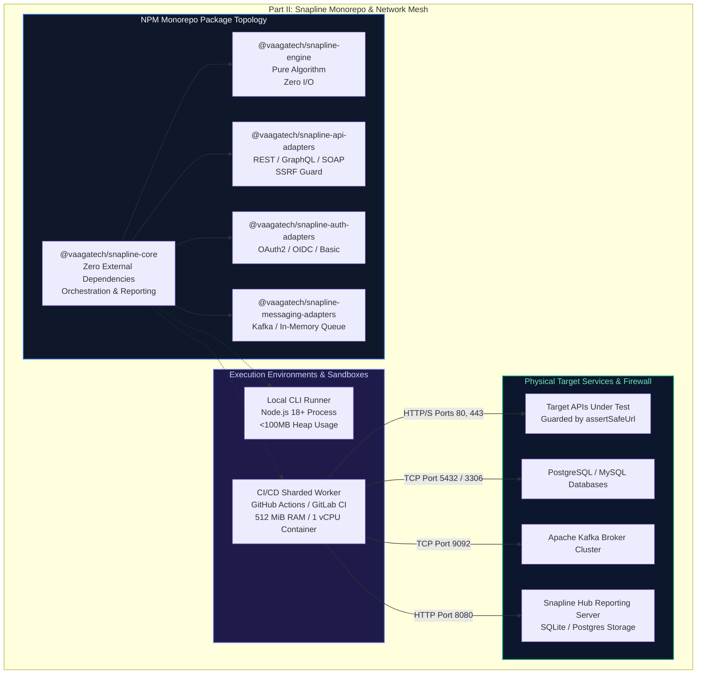

# Snapline Architecture: Logical & Technical Specifications

## Executive Summary

**Snapline** is an enterprise declarative reconciliation and multi-protocol test automation platform engineered by VaagaTech. It validates service correctness across APIs (REST, GraphQL, SOAP), databases (PostgreSQL, MySQL, Snowflake, BigQuery), and message queues (Apache Kafka, in-memory) by comparing live responses against verified baseline fixtures with zero-tolerance structural diffing.

---

## Part I: Logical Architecture

The logical architecture decouples multi-protocol execution, authentication, and I/O from the deterministic, in-memory reconciliation engine.

```mermaid
graph TD
    subgraph Part_I_Logical_Architecture["Part I: Snapline Logical Reconciliation Pipeline"]
        subgraph Stage_1["1. Multi-Protocol Ingestion & Handshake"]
            CFG[TestSuiteConfig<br/>name, auth, cases] --> AUTH[Auth Token Handshake<br/>OAuth2 / OIDC / Basic]
            AUTH --> API[API Protocol Adapter<br/>REST / GraphQL / SOAP]
            AUTH --> DB[Database Adapter<br/>DbConnectionLike SQL/Warehouse]
            AUTH --> MSG[Messaging Adapter<br/>Kafka publishAndPoll]
        end

        subgraph Stage_2["2. Normalization & Scrubbing"]
            API --> MAP[Transformations & dataMapping]
            DB --> MAP
            MSG --> MAP
            MAP --> SORT[Lexicographical Key Sort<br/>Deterministic Object Trees]
            SORT --> SCRUB[Dynamic Token Scrubbing<br/>ignoreFields Regex / UUIDs / Timestamps]
        end

        subgraph Stage_3["3. Pure AST Reconciliation"]
            SCRUB --> CMP[snapline-engine<br/>Pure Zero-I/O Comparator]
            FIX[Expected Baseline Fixture<br/>case.json / expected.json] --> CMP
            CMP --> DIFF[Structural AST Diffing<br/>Float Epsilon & Unordered Arrays]
            DIFF --> RES[TestSuiteResult<br/>match: boolean, diff: JsonPatch]
        end

        subgraph Stage_4["4. Audit Trail & Reporting"]
            RES --> RED[PII & Secret Redaction<br/>redactFields Masking]
            RED --> REP[HTML & JSON Report Generator<br/>writeTestReport]
            RED --> HUB[Snapline Hub Client<br/>pushTestReportToHub]
            RED --> CLI[CLI Exit Codes<br/>0: Pass / 1: Diff / 2: Error]
        end
    end

    classDef stage fill:#0f172a,stroke:#3b82f6,stroke-width:1.5px,color:#f8fafc;
    classDef engine fill:#1e293b,stroke:#f59e0b,stroke-width:1.5px,color:#fde68a;
    classDef audit fill:#0c162d,stroke:#10b981,stroke-width:1.5px,color:#6ee7b7;
    class Stage_1,Stage_2 stage;
    class Stage_3 engine;
    class Stage_4 audit;
```

### Core Logical Subsystems

1. **Protocol Ingestion Handshake**:
   - `executeApi`: Executes REST, GraphQL, and SOAP requests with automatic bearer token attachment.
   - `DbConnectionLike`: Minimal vendor-agnostic interface allowing consumer-managed PostgreSQL, MySQL, SQLite, Snowflake, and BigQuery drivers.
   - `publishAndPoll`: Publishes test messages to message brokers (e.g. Apache Kafka) and actively polls database/queues until reconciliation state settles or timeout expires.

2. **Structural Scrubbing & Normalization**:
   - Recursive sorting of object keys ensures comparisons are immune to JSON serialization key re-ordering.
   - `ignoreFields`: Regular expressions and JSONPath selectors dynamically strip non-deterministic tokens (timestamps, random nonces, session identifiers).
   - `transformations`: Field-level functional mappers convert custom representations into canonical comparison targets.

3. **Pure Zero-I/O Reconciliation Engine (`snapline-engine`)**:
   - Executes strictly in-memory without filesystem access, network queries, or external process calls.
   - Floating-point comparisons adhere to configurable delta tolerances (`epsilon`).
   - Generates RFC-6902 JSON Patch compliant diffs indicating exact path additions, deletions, and mismatches.

4. **Auditing, Redaction & Reporting**:
   - `redactFields`: Systematic masking prevents credentials, bearer tokens, and PII from leaking into logs or reports.
   - `writeTestReport`: Produces zero-dependency standalone HTML reports with inline SVG diff visualizations and machine-readable JSON summaries.

---

## Part II: Technical Architecture

The technical architecture defines the monorepo package encapsulation, zero-runtime dependency core, CI/CD sandbox runner profiles, SSRF network guards, and physical port bindings.

### Physical Port Matrix & Firewall Rules

| Service / Component | Port | Protocol | Direction | Security Boundary |
| :--- | :--- | :--- | :--- | :--- |
| `snapline-api-adapters` | 80 / 443 | HTTP/1.1, HTTP/2 | Outbound | SSRF Guard (`assertSafeUrl` blocks `169.254.169.254`) |
| `snapline-auth-adapters` | 443 | HTTPS | Outbound | TLS 1.3 + In-Memory Token Isolation |
| `snapline-messaging-adapters` | 9092 / 9094 | TCP / SSL | Outbound | SASL/SCRAM or mTLS Client Authentication |
| Relational SQL (Postgres / MySQL) | 5432 / 3306 | TCP / TLS | Outbound | `DbConnectionLike` consumer connection pool |
| `snapline-hub` (API / UI) | 8080 | HTTP | Inbound / Outbound | Internal Corporate Subnet / API Key Auth |
| `snapline-hub` (Prometheus) | 9090 | HTTP | Inbound | Prometheus Monitoring Scraper Only |

### Resource Envelopes & Memory Governor

| Workload Mode | Memory (RAM) Limit | CPU Allocation | Execution Guarantees |
| :--- | :--- | :--- | :--- |
| **Local CLI Execution** | 64 MiB - 128 MiB | Single Node.js thread | Sub-second test execution; zero lingering sockets. |
| **CI/CD Sharded Worker** | 512 MiB limit | 1 vCPU | Bounded AST buffers; memory leak free across 10,000 cases. |
| **Snapline Hub Server** | 256 MiB - 1.0 GiB | 0.5 - 2 vCPU | Paged disk caching for historical reports; SQLite WAL mode. |

### SSRF Protection & Network Isolation
1. **Host Verification (`assertSafeUrl`)**: Outbound requests strictly forbid link-local and cloud metadata addresses (`169.254.169.254`, `metadata.google.internal`), preventing credential theft.
2. **Private Network Lockdown**: Outbound requests to RFC-1918 subnets (`10.0.0.0/8`, `172.16.0.0/12`, `192.168.0.0/16`) are blocked by default unless explicitly allowlisted in configuration.
3. **Hardened Deadlines**: A 30,000ms global timeout aborts hung sockets and releases socket handles, preventing descriptor exhaustion.

### High Availability & Disaster Recovery (HA/DR)

| Metric | Target SLA | Implementation Mechanism |
| :--- | :--- | :--- |
| **Recovery Point Objective (RPO)** | `RPO = 0` | All test fixtures and expected JSON baselines are tracked in Git VCS as immutable source of truth. |
| **Recovery Time Objective (RTO)** | `RTO < 100ms` | Local and CI runners spin up instantaneously with zero external infrastructure cold-starts. |
| **Determinism Guarantee** | 100% Deterministic | Pure functional diffing algorithm guarantees identical outputs for identical AST inputs. |
| **Hub Backup / Restore** | RPO < 1 hr / RTO < 5m | Automated SQLite WAL snapshots or PostgreSQL point-in-time recovery. |
